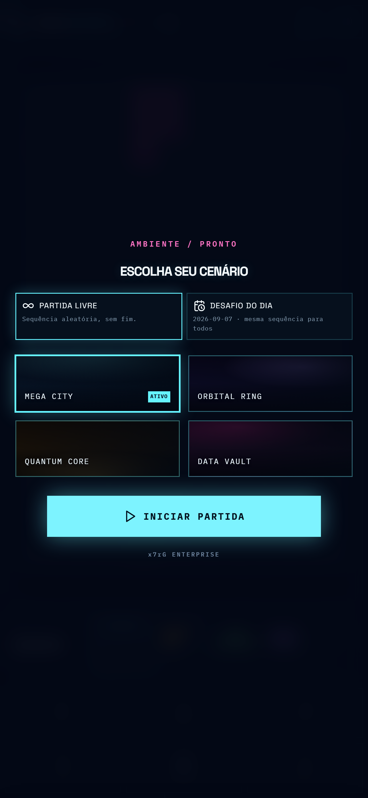
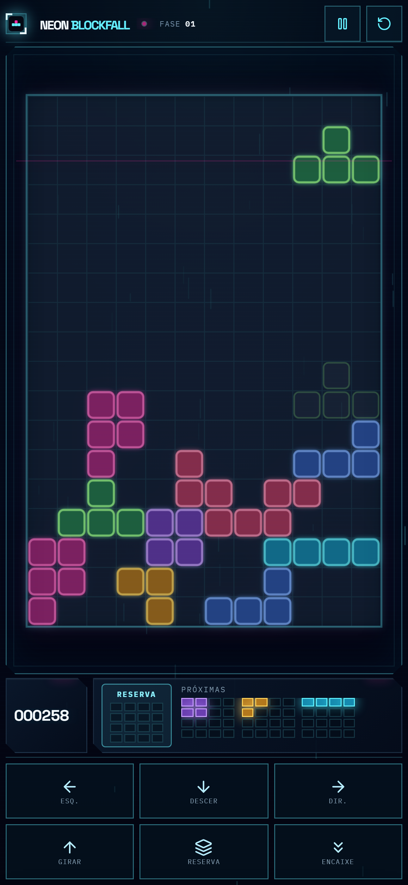
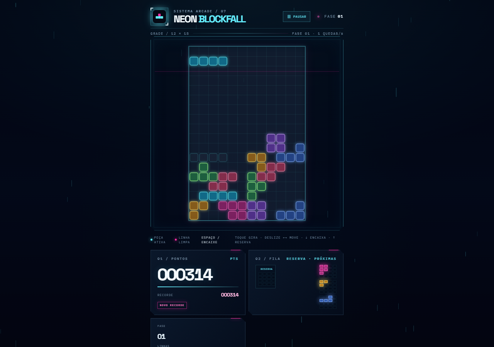
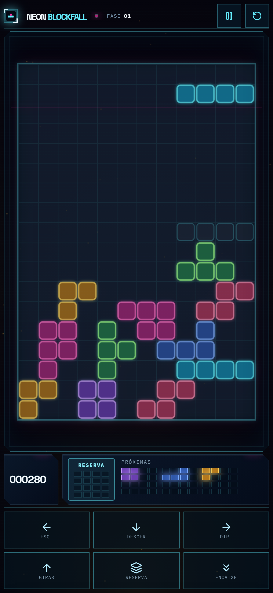

<div align="center">


# Neon Blockfall

**Jogo arcade de blocos que caem. Jogável offline; ranking online para disputar com amigos.**


Publicado por **x7rG ENTERPRISE**

</div>

---

## Screenshots

| Início | Partida (celular) | Partida (desktop) |
| :---: | :---: | :---: |
|  |  |  |

<div align="center"></div>

---

## Ferramentas de desenvolvimento

| Camada | Ferramenta | Versão | Papel |
| --- | --- | --- | --- |
| Linguagem | **TypeScript** | 5.9 | Todo o código, com `strict` ligado |
| UI | **React** | 19 | Componentes da casca (HUD, menus, overlays) |
| Build / dev server | **Vite** | 7 | Bundler, HMR, `import.meta.env`, modos de build |
| Estilo | **Tailwind CSS** | 4 (`@tailwindcss/vite`) | Utilitários + `index.css` próprio para o HUD |
| Ícones | **lucide-react** | 0.453 | Ícones da interface |
| Toaster | **sonner** | 2 | Notificações não-bloqueantes |
| Roteamento | **wouter** | 3 | Rotas mínimas (`/`, 404) |
| Render da arena | **Canvas 2D** (nativo) | — | Grade, peças, ghost, partículas, shake, FX de cenário |
| Áudio | **Web Audio API** (nativo) | — | Efeitos e trilha sintetizados em tempo real, sem assets |
| Testes | **Vitest** | 2 | 21 testes das regras puras do jogo |
| Formatação | **Prettier** | 3 | `pnpm format` |
| Empacotamento | **Capacitor** | 7 | App Android nativo a partir do build web |
| Anúncios | **@capacitor-community/admob** | 7 | Banner + intersticial (só no build nativo) |
| Gerenciador de pacotes | **pnpm** | 10 | `node-linker=hoisted` (drive exFAT) |
| CI | **GitHub Actions** | — | APK de teste + AAB assinado na nuvem |
| Ranking online | **Google Play Games Services** | — | Placar global e de amigos (login com conta Google) |

Sem engine 3D, sem backend próprio, sem framework de UI pesado. O núcleo do jogo
(`client/src/game/`) é **TypeScript puro**, sem depender de React nem do canvas —
por isso dá para testá-lo isoladamente com Vitest. O jogo funciona **offline**; o
**ranking online** usa o Google Play Games (não há servidor próprio).

---

## Scripts

| Comando | Ação |
| --- | --- |
| `pnpm dev` | Servidor de desenvolvimento (Vite). Use `--host` para abrir no celular. |
| `pnpm build` | Build de produção em `dist/` (anúncios **de teste**). |
| `pnpm preview` | Serve o build de produção. |
| `pnpm check` | Verificação de tipos (`tsc --noEmit`). |
| `pnpm test` | Testes unitários (Vitest). |
| `pnpm format` | Prettier em todo o repositório. |
| `pnpm android:add` | Cria a pasta `android/` nativa (uma vez). |
| `pnpm cap:sync` | `build` + `cap sync` + ajustes nativos (`scripts/android-postsync.mjs`). |
| `pnpm android:open` | `build` + `sync` + abre no Android Studio. |
| `pnpm android:release` | Build modo `androidrelease` (anúncios **reais**) + sync + Android Studio. |

---

## O jogo

- Grade **12 × 18**. Conjunto de peças próprio — `SPARK`, `BEAM`, `SLAB`, `FORK`,
  `COIL`, `HOOK`, `CREST` — de 3, 4 e 5 células. Fila de **3 peças** + **reserva**
  (1× por peça).
- **Pontuação:** linha simples/dupla/tripla/+ = `60 / 160 / 320 / 560 / 900 × fase`,
  com bônus de **combo**, **back-to-back** (×1,5 em 3+ linhas) e **perfect clear**.
  Hard drop = +2/célula, soft drop = +1/célula.
- Nova **fase a cada 8 linhas**; a queda acelera a cada fase (piso ~90 ms).
- **Modificadores de fase** (a partir da fase 4, alternando com fases calmas):
  `SOBRECARGA` (linha-lixo sobe pela base), `PULSO` (gravidade em rajadas),
  `BLACKOUT` (as 3 linhas de baixo no escuro). **Checkpoints** nas fases múltiplas de 5.
- **Desafio do Dia:** semente fixa — mesma sequência de peças para todo mundo no dia —
  com melhor pontuação do dia salva no aparelho e botão de compartilhar.
- **Ranking online:** placar global e **de amigos** via Google Play Games (o jogador
  entra com a conta Google que já tem no aparelho). Placar local no aparelho como base.
- **Cenários** visuais (Mega City, Orbital Ring, Quantum Core, Data Vault) com efeitos
  de fundo próprios; não alteram a física.
- **Lock delay** (~0,5 s, com reset ao mover) e **DAS/ARR** no teclado e no toque.
- **Toque:** deslizar move · tocar gira · deslizar ↓ = encaixe · ↑ = reserva ·
  botões grandes no rodapé com legenda.
- **Teclado:** setas, `Z` (gira ao contrário), `SPACE` (encaixa), `C`/`Shift`
  (reserva), `P` (pausa), `R` (reinicia). Remapeável em Configurações.
- A partida em andamento é salva no aparelho e **retomada** ao reabrir.

---

## Estrutura

```
client/
  index.html
  public/            icon.svg, manifest, sw.js, privacy.html
  src/
    components/       GameCanvas + primitivos de UI
    game/             regras puras, renderer 2D, áudio, RNG, controles, placar local,
                      Desafio do Dia, modificadores de fase
    mobile/           bootstrap nativo + integração AdMob (no-op no web)
    pages/            Home (casca da partida) + NotFound
    index.css
scripts/
  android-postsync.mjs   ajustes nativos idempotentes (AdMob App ID, versão, assinatura)
.github/workflows/
  android-build.yml      APK de teste (debug, não assinado)
  android-release.yml    AAB assinado para a Play Store
capacitor.config.ts
```

---

## Publicar na Play Store (Android)

Requer **JDK 21** (Capacitor 7). O build nativo pode ser feito no **GitHub
Actions** (sem Android Studio local).

1. **Anúncios** — já configurados em `client/src/mobile/ads.ts` com os IDs reais.
   `pnpm build` usa anúncios de teste; `pnpm android:release` (modo
   `androidrelease`, arquivo `client/.env.androidrelease`) usa os reais.
2. **App ID do AdMob** — aplicado automaticamente no `AndroidManifest.xml` por
   `scripts/android-postsync.mjs` após cada `cap sync`.
3. **Assinatura** — gere um keystore (`keytool -genkeypair ...`), guarde-o em
   lugar seguro (fora do repositório) e cadastre 4 segredos no GitHub:
   `ANDROID_KEYSTORE_BASE64`, `ANDROID_KEYSTORE_PASSWORD`, `ANDROID_KEY_ALIAS`,
   `ANDROID_KEY_PASSWORD`.
4. **Gerar o `.aab`** — aba **Actions → Android AAB (release assinado) → Run
   workflow**. O artefato `neon-blockfall-release-aab` é o que sobe na Play Console.
5. **Play Games Services** — no console do Play Games, vincular o app, criar o
   leaderboard e cadastrar o **SHA-1** do keystore. O ID do leaderboard vai no código.
6. **Ficha da loja** — política de privacidade publicada em `/privacy.html`;
   formulário *Data Safety* deve declarar coleta do *ID de publicidade* (AdMob) e,
   com o ranking online, o login pelo Google Play Games.

---

## Privacidade

O jogo em si não coleta dados pessoais e é jogável offline. Dois pontos usam
serviços do Google:

- **Anúncios (AdMob):** o build nativo exibe anúncios que processam dados de
  publicidade do dispositivo. Em regiões que exigem consentimento, o app mostra o
  formulário do UMP antes de anúncios personalizados.
- **Ranking online (Play Games):** ao entrar no placar de amigos, o jogador se
  autentica com a conta Google do aparelho; o Google gerencia essa identidade e a
  pontuação enviada.

Detalhes e base legal (LGPD) em
[`client/public/privacy.html`](client/public/privacy.html).

---

<div align="center">

**© 2026 x7rG ENTERPRISE** — Todos os direitos reservados.

[](https://www.linkedin.com/in/rgds)
&nbsp;
[](https://www.instagram.com/_7ragnar/)

</div>
